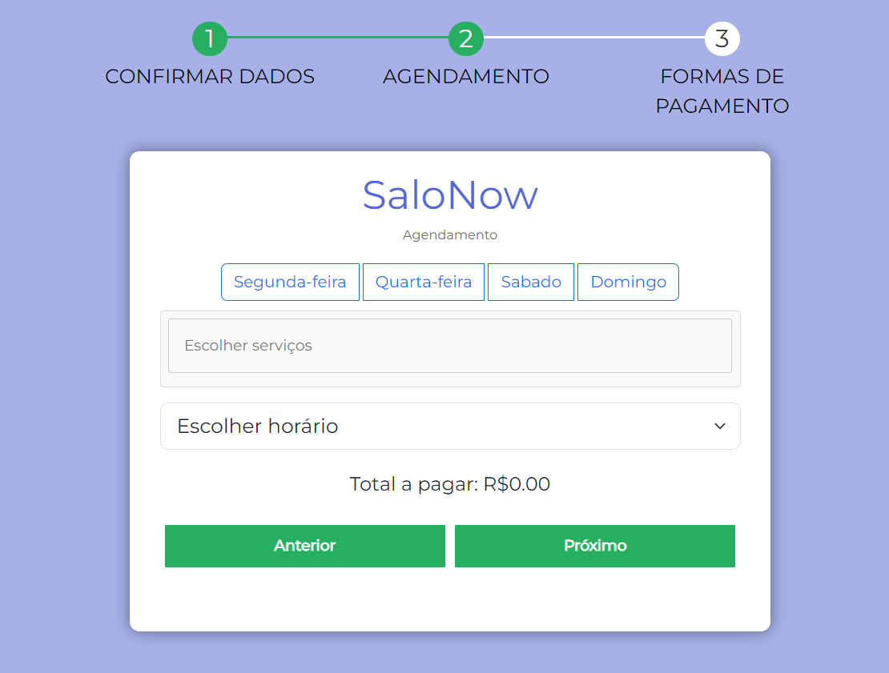

<h1 align="center">SaloNow</h1>
<h2 align="center">Software: gestão de salões de beleza</h2>

    

    

    

    

    

    

### Tópicos 

:small_blue_diamond: [Descrição do projeto](#descrição-do-projeto)

:small_blue_diamond: [Funcionalidades](#funcionalidades)

:small_blue_diamond: [Atualizações futuras](#atualizações-futuras)

## Descrição do projeto 

    O projeto Salonow é uma inovadora solução de software desenvolvida no âmbito da disciplina de Gerenciamento de Projetos, sob a orientação do Prof. Rodrigo Costa. O objetivo principal do projeto é criar uma plataforma abrangente e eficiente para a gestão de salões de beleza, visando otimizar os processos internos, aprimorar a experiência dos clientes e impulsionar o sucesso dos negócios no setor de beleza e bem-estar.

    O Trello serviu como a ferramenta central para implementar a metodologia Kanban no projeto Salonow. Cada cartão representava uma tarefa, e as colunas no quadro do Trello refletiam os estágios do fluxo de trabalho, como "A fazer", "Em andamento", "Testes" e "Concluído". Isso permitiu que a equipe rastreasse facilmente o progresso e as responsabilidades de cada tarefa.

    O resultado do projeto Salonow é um software de gestão de salões de beleza altamente funcional, desenvolvido de forma colaborativa com base na metodologia Kanban e gerenciado eficazmente através da plataforma Trello. Com essa abordagem, a equipe conseguiu criar uma solução que atende às demandas complexas do setor, proporcionando uma experiência aprimorada para os clientes e processos de negócios eficientes para os salões de beleza.

<u>[Link do Trello](https://trello.com/b/LexBUp1h/projeto-sal%C3%A3o-de-beleza)</u>

## Funcionalidades
:heavy_check_mark: __Agendamento simplificado__

    O Salonow oferece um sistema intuitivo de agendamento, permitindo que os clientes marquem seus serviços e selecionem horários convenientes. baseado no cadastro do salão e suas caracteríticas de disponibilidade.

:heavy_check_mark: __Cadastrar salões__

    O cadastro de salões no Salonow é um processo essencial que permite aos proprietários dos salões de beleza criar e gerenciar perfis detalhados de seus estabelecimentos na plataforma.

* Adição de banner/imagem

* Informações sobre o salão

* Serviços oferecidos

* Dias e horários de funcionamento

* Tela de gerenciamento de salões do proprietário

:heavy_check_mark: __Editar e excluir salões__

    A funcionalidade de edição de salões no Salonow desempenha um papel crucial no gerenciamento flexível e contínuo das informações e operações dos estabelecimentos de beleza. Permite aos administradores ajustar e atualizar detalhes cruciais sobre o salão, seus serviços, imagem, localidade e disponibilidade de agendamento. 

:heavy_check_mark: __Gerenciamento de agendamentos do proprietário__

    Uma tela de visualizar todos ou os específicos agendamentos de um ou mais salões. Pode marcar como concluído ou excluir o agendamento. 

:heavy_check_mark: __Relatórios__

    O Salonow mantém um registro detalhado dos clientes, incluindo histórico de serviços, preferências pessoais e informações de contato, permitindo um atendimento personalizado e eficaz. Os agendamentos marcados como concluídos ficam salvos em cache no banco de dados e ficam lá por um ano e depois são exluídos permanentemente.

:heavy_check_mark: __Sistema de localidades por CEP__

    O Sistema de Localidades por CEP é uma parte essencial do Salonow que oferece uma maneira eficaz de gerenciar as informações de localização dos clientes e dos salões de beleza. A filtragem é feita automaticamente e orderna os salões de forma que as localidades iguais ficam no topo. Já a barra de pesquisa permite procurar salões por cidades, bairros, ruas, etc. A pesquisa pode ser feita também de forma conjugada, permitindo encontrar sua localidade desejada.

:heavy_check_mark: __Visualização da tela do cliente__

## Atualizações futuras

> Status do Projeto: :warning: (em construção)

* Sistema de avaliações dos salões
* Responsividade
* Paginação de salões (Tela do cliente)
